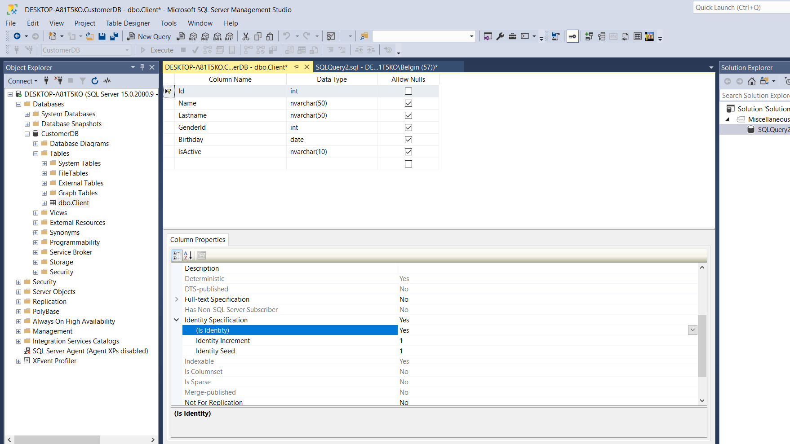
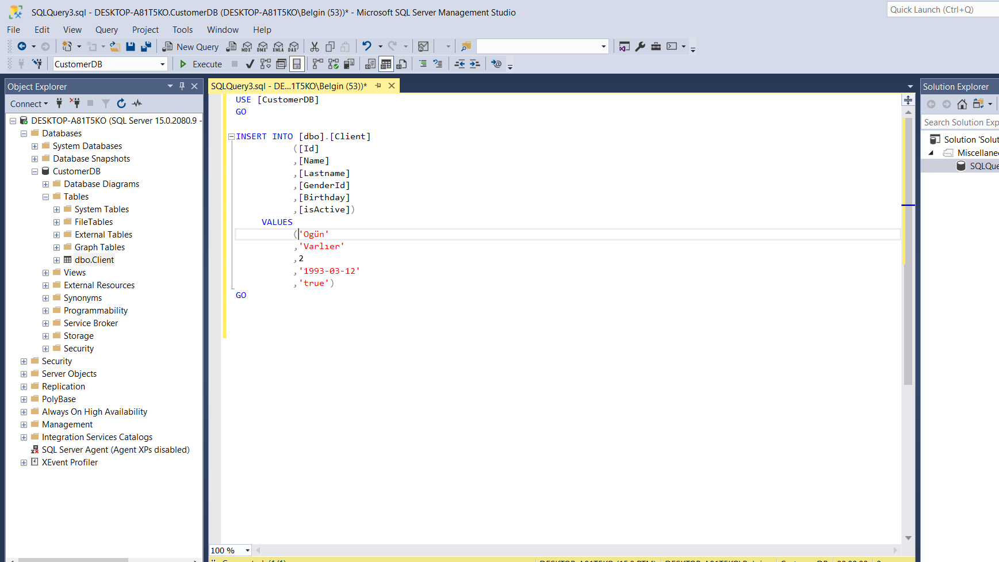
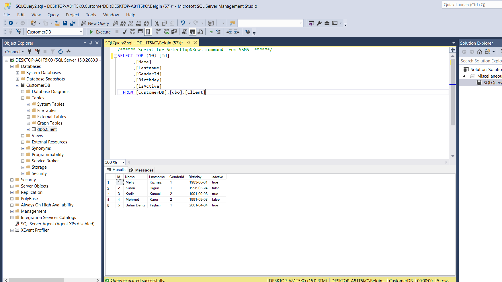
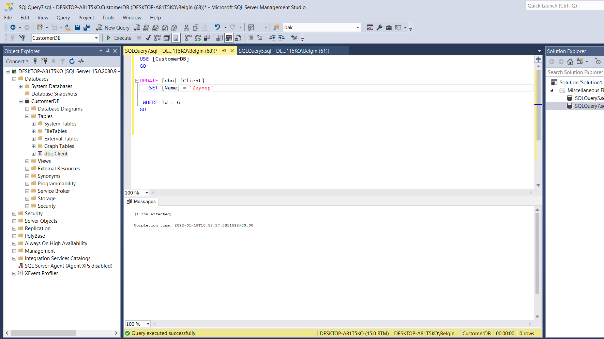
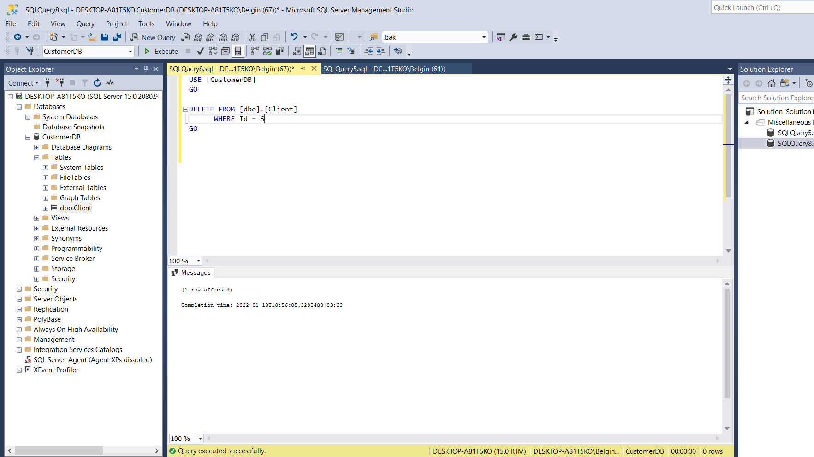
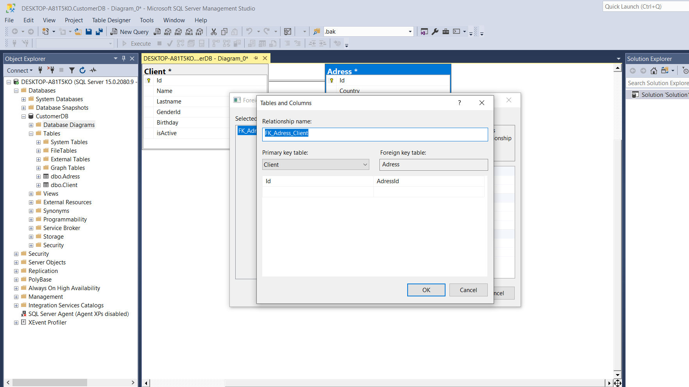

## SQL Database Operations

### In this assignment;
 

- I created an SQL Database called CustomerDB
- Two tables : Client and Adress
- Inner Join between tables

### Create Client Table

### Insert Into Operations

### Select Table

### Update Client

### Delete Client

### Join two tables

